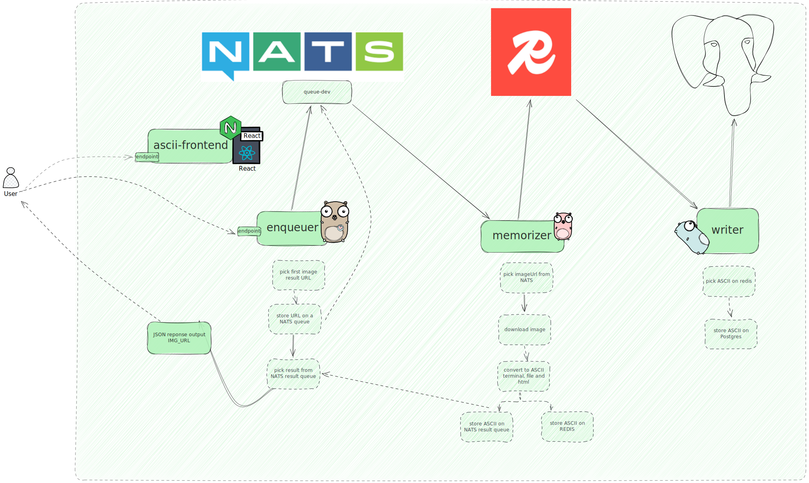

# Fullstack Microservices Messaging System

A scalable, distributed system for processing and transforming messages with image-to-ASCII art capabilities.

## Overview

This project demonstrates a modern microservices architecture that processes messages through a pipeline of services. The system allows users to submit text descriptions, automatically finds relevant images, and transforms them into ASCII art representations.


## System Architecture

The system consists of multiple microservices communicating via message queues:



### Complete Message Flow

1. **User Request**: User accesses `ascii-frontend` and submits a query (e.g., "kubernetes")
2. **Enqueuer Processing**:
   - Receives the query via REST API (`POST /add`)
   - Searches Google Images using Chromium headless browser
   - Picks the first suitable image URL
   - Publishes message with image URL to NATS queue (`{ENV}.queue-{QUEUE_NAME}`)
   - Subscribes to result queue (`{ENV}.result-queue`) to wait for ASCII art response
3. **Memorizer Processing**:
   - Listens to NATS queue for new messages
   - Downloads the image from the URL
   - Generates ASCII art (terminal, file, and HTML formats)
   - Stores the ASCII art output in Redis (with environment prefix: `{ENV}:{MESSAGE_ID}:ascii_*`)
   - Publishes the result back to NATS result queue
4. **Enqueuer Response**:
   - Receives ASCII art result from NATS result queue
   - Returns complete response to the user (including image URL and ASCII art)
5. **Writer Storage**:
   - Monitors Redis for new entries
   - Retrieves processed messages with ASCII art
   - Stores everything in PostgreSQL (environment-specific tables)
   - Provides query endpoints for historical data

### Technology Stack

- **Communication**: NATS for message queuing
- **Storage**: Redis for temporary storage, PostgreSQL for persistent storage
- **Deployment**: Kubernetes with Kustomize configurations
- **Observability**: OpenTelemetry for distributed tracing
- **Testing**: Cypress for end-to-end testing

## Services

### Enqueuer

The entry point for the system. Receives message requests, searches for relevant images, and publishes messages to NATS.

**Key Features:**
- RESTful API for accepting messages
- Image search capability using web scraping
- Message publishing with trace context propagation
- Health check endpoints

### Memorizer

Processes messages from NATS, stores them in Redis, and converts images to ASCII art.

**Key Features:**
- NATS subscription with environment-based routing
- Python-based image-to-ASCII conversion
- Multiple ASCII formats (terminal, file, HTML)
- Redis storage with environment prefixing

### Writer

Subscribes to processed messages from Redis, stores them in PostgreSQL, and provides query endpoints.

**Key Features:**
- Environment-specific database tables
- RESTful API for querying stored messages
- ASCII art retrieval endpoints
- Database connection pooling and retry logic

### ASCII Frontend

Web application that provides a user interface for submitting message descriptions and viewing ASCII art.

**Key Features:**
- React-based user interface
- Environment-aware API communication
- Multiple ASCII art view modes (HTML and Text)
- Copy/download functionality for generated art

## Setup & Installation

### Prerequisites

- Docker and Docker Compose
- Kubernetes cluster (for production deployment)
- Go 1.23.1
- Node.js (for frontend and Cypress tests)

### Local Development

1. Clone the repository:
   ```bash
   git clone https://github.com/fullstack-pw/demo-apps.git
   cd demo-apps
   ```

2. Start the local environment:
   ```bash
   docker-compose up -d
   ```

3. Run the services individually for development:
   ```bash
   # Enqueuer
   cd apps/enqueuer
   go run main.go
   
   # Memorizer
   cd apps/memorizer
   go run main.go
   
   # Writer
   cd apps/writer
   go run main.go
   
   # ASCII Frontend
   cd apps/ascii-frontend
   npm install
   npm run dev
   ```

## Development & Testing

### Running Tests

The project uses Cypress for end-to-end testing:

```bash
# Install dependencies
npm install

# Run Cypress tests in development environment
npm run cypress:dev

# Run Cypress tests in staging environment
npm run cypress:stg

# Run Cypress tests in production environment
npm run cypress:prod

# Run Cypress tests in local environment
npm run cypress:local
```

### Adding New Tests

Test files are located in the `cypress/e2e/` directory. The system provides custom Cypress commands defined in `cypress/support/commands.js` for common operations like sending messages and verifying processing.

## Deployment

The project uses Kubernetes with Kustomize for deployment. Each service has base configurations and environment-specific overlays:

```
apps/
├── enqueuer/
│   └── kustomize/
│       ├── base/
│       ├── overlays/
│           ├── dev/
│           ├── stg/
│           └── prod/
├── memorizer/
│   └── kustomize/
│       └── ...
├── writer/
│   └── kustomize/
│       └── ...
└── ascii-frontend/
    └── kustomize/
        └── ...
```

### Deploying to an Environment

```bash
# Deploy to development
kubectl apply -k apps/enqueuer/kustomize/overlays/dev
kubectl apply -k apps/memorizer/kustomize/overlays/dev
kubectl apply -k apps/writer/kustomize/overlays/dev
kubectl apply -k apps/ascii-frontend/kustomize/overlays/dev

# Deploy to staging or production
kubectl apply -k apps/*/kustomize/overlays/stg
kubectl apply -k apps/*/kustomize/overlays/prod
```

The project also includes GitHub Actions workflows for CI/CD in `.github/workflows/`.

## API Documentation

### Enqueuer API

- `POST /add`: Add a new message to the queue
  - Query Parameters:
    - `queue`: Queue name (default: "default")
  - Request Body:
    ```json
    {
      "id": "optional-message-id",
      "content": "Message content or description",
      "headers": {
        "optional-header-key": "optional-header-value"
      }
    }
    ```
  - Response:
    ```json
    {
      "status": "completed",
      "queue": "queue-name",
      "image_url": "https://example.com/image.jpg",
      "image_ascii_text": "ASCII art text representation",
      "image_ascii_html": "<pre>HTML ASCII art</pre>"
    }
    ```

- `GET /check-memorizer`: Check if a message was processed by memorizer
  - Query Parameters:
    - `id`: Message ID
  - Response:
    ```json
    {
      "id": "message-id",
      "processed": true
    }
    ```

- `GET /check-writer`: Check if a message was stored by writer
  - Query Parameters:
    - `id`: Message ID
  - Response: Returns the stored message with additional metadata

- `GET /ascii/terminal`: Get terminal ASCII art for a message
  - Query Parameters:
    - `trace_id`: Trace ID
  - Response: Plain text ASCII art

- `GET /ascii/html`: Get HTML ASCII art for a message
  - Query Parameters:
    - `trace_id`: Trace ID
  - Response: HTML ASCII art

### Writer API

- `GET /query`: Query for a stored message
  - Query Parameters:
    - `id`: Message ID
  - Response: The stored message with ASCII art references

- `GET /ascii/terminal`: Get terminal ASCII art for a message
  - Query Parameters:
    - `id`: Message ID
  - Response: Plain text ASCII art

- `GET /ascii/file`: Get file ASCII art for a message
  - Query Parameters:
    - `id`: Message ID
  - Response: Plain text ASCII art with download header

- `GET /ascii/html`: Get HTML ASCII art for a message
  - Query Parameters:
    - `id`: Message ID
  - Response: HTML ASCII art

### Health Endpoints

All services provide the following health endpoints:

- `GET /health`: Overall service health
- `GET /livez`: Liveness probe
- `GET /readyz`: Readiness probe

## Contributing

### Code Structure

- `apps/`: Contains all service code
  - `enqueuer/`: Enqueuer service
  - `memorizer/`: Memorizer service
  - `writer/`: Writer service
  - `ascii-frontend/`: Web frontend
  - `shared/`: Shared Go packages
- `cypress/`: End-to-end tests
- `.github/workflows/`: CI/CD workflows

### Contribution Guidelines

1. Create a feature branch off of main
2. Make your changes
3. Run tests to ensure functionality
4. Submit a pull request

## License

This project is licensed under the MIT License - see the LICENSE file for details.